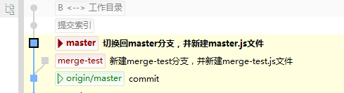
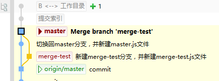
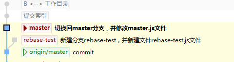
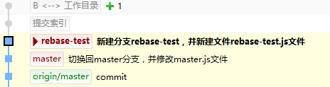
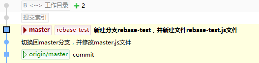

# git-command-tips

记录一下平时经常使用的命令，遇到的问题

## 1、设置用户名和邮箱

```js
git config --global user.name <userName>
git config --global user.email <userEmail>
```

## 2、清除远程已删除，但是在本地查看远程分支时还存在的分支

```js
$ git branch -a
// 远程dev分支已经被合并删除了，但是本地查看还存在
* dev
  master
  remotes/origin/HEAD -> origin/master
  remotes/origin/dev
  remotes/origin/master

$ git pull -p
// 远程分支已经没有了dev，只有本地的dev分支，可以git branch -d dev 删除本地分支
* dev
  master
  remotes/origin/HEAD -> origin/master
  remotes/origin/master
```

## 3、推送本地分支到远程

```js
git push origin <branchName>
```

## 4、删除远程分支

```js
git push origin --delete <branchName>
```

## 5、本地分支与远程分支关联

遇到的报错

fatal: The current branch dev has no upstream branch.
To push the current branch and set the remote as upstream, use

git push --set-upstream origin dev

```js
git push --set-upstream origin dev
// 或者
git branch -u origin dev
```

## 6、删除本地分支和远程分支

```js
// 查看当前分支
git branch -a

// 删除本地分支
git branch -d <branchName>

// 删除远程分支
git push origin --delete <branchName>
```

## 7、merge与rebase

merge的基本用法

```js
// 创建并切换到merge-test
git checkout -b merge-test
// 创建一次提交
git commit
// 切换回master分支，并创建一次提交
git checkout master
// 创建一次提交
git commit
```



在master分支执行命令

```js
git merge merge-test
```



***

rebase基本用法

```js
// 创建并切换到rebase-test
git checkout -b rebase-test
// 创建一次提交
git commit
// 切换回master分支，并创建一次提交
git checkout master
// 创建一次提交
git commit
```



切换到rebase-test分支，并执行rebase命令

```js
git checkout rebase-test

git rebase master
```



切换回master，并执行rebase命令

```js
git checkout master
// master的指针移动到最新的提交
git rebase rebase-test
```



***

merge与rebase的区别

1. merge会合并分支代码到主分支，并创建一次merge提交，会保留完整的提交记录
2. rebase会在master分支上创建新的提交，只留干净的提交树


通过比较两个命令的结果，再考虑实际项目中使用哪个命令

## 8、reset

```js
git reset --<mode> head
```

有三种模式 hard soft mixed

hard: 重置到某个节点，其它修改全部清空
soft: 重置到某个节点，工作目录和暂存区不变
mixed: 没有mode时默认选项，重置到某个节点，所有修改都会放到工作目录中
